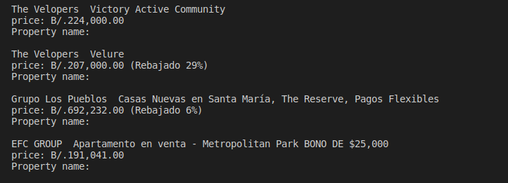

# Scraper Tool - For Real State website (Capstone Project)

> This tool allows the user to find a target in a given website. The tool was created with the concept of Leads Generation in mind, but it can be used for different purposes, for example, getting a list of prices from a website, getting email contacts, relevant positions from a company website, etc. In this case, after giving the proper URL to the tool, it will search for Property Names and Prices, and revert with a list of all items found followed by their prices.

In order to achieve this, Nokogiri gem needs to be used so we can actually get the functionality of scraping and just modify the parameters for the queries as needed.

## Built With

- Ruby
- Nokogiri gem
- RSpec for testing
- Rubocop for better quality code

## Getting Started

**To get a local copy up and running follow these simple example steps.**

- Clone this repository to a local folder
- Run `bundle install` in order to install the gems needed
- In the terminal, change to `bin` folder by typing `cd bin`
- From `/bin`, run the command `ruby main.rb`

### Prerequisites

- Text editor
- Ruby >= 2.5
- Nokogiri

### Setup

It's important hat you have the proper environment set up in order to be able to use this tool. Which includes having a text editor, ruby environment and install nokogiri gem. Please see the instructions below.

### Install

- For a step by step guide on how to install Ruby, please take a look to [this](https://www.ruby-lang.org/en/documentation/installation/) link.
- For installing Nokogiri gem you should be good by running the command `gem install nokogiri`, however, for a better understanding please follow [this](https://nokogiri.org/rdoc/index.html) link .

### Usage

This tool has some preset values for the queries it performs, however, if you want to give it a try with a different website or just a different query, please see note the following:

- In order to get information from a website this app needs the URL from where you want the info from.
- It also needs the name of the Class or element containing the information you are looking for, in this case we used the CSS selector `_8s3ctt`
- It also needs the class of the actual element that you want to retrieve with this tool, in our example, would be the class for the element containing the Title of the properties, and also the class for the element containing the prices. Which are, `_bzh5lkq` and `_olc9rf0` respectively
- For you to be able to find the classes mentioned above, you will need to `inspect` the website you want to scrape. On most browsers you can just right click on the element you are interested in and select `inspect`.

Note:

- There 2 test cases:
  - Test case 1: It returns the data by manually implementing some logic
  - Test case 2: It returns the data by using instance methods

## Authors

👤 **Alexander Morales**

- GitHub: @alexandermorales-dev
- Twitter: @Alexand81099721
- LinkedIn: AlexanderMorales
- Email: alexandermorales.n1@gmail.com

## 🤝 Contributing

Contributions, issues, and feature requests are welcome!

Feel free to check the [issues page](../../issues/).

## Show your support

Give a ⭐️ if you like this project!

## Acknowledgments

- Microverse
- The Odin Project
- Codecademy

## 📝 License

This project is [MIT](./MIT.md) licensed.
